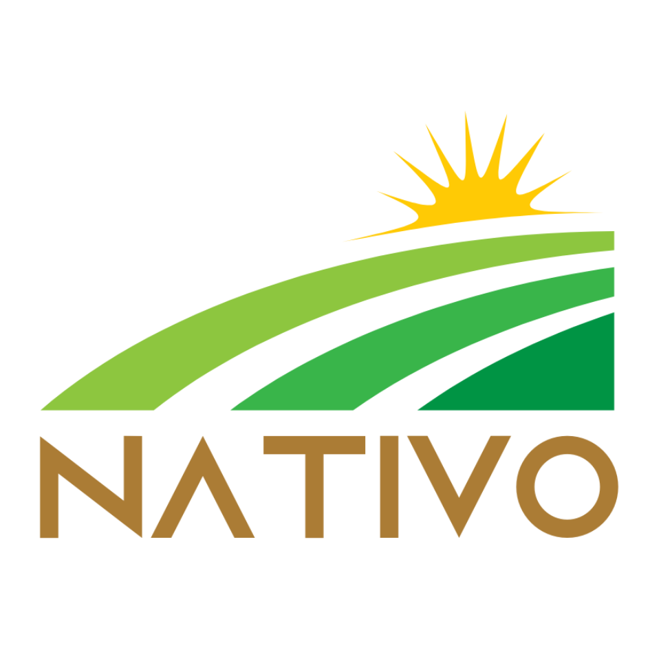

# Nativo Banco Rural
<p align="center">
  
</p>
**Nativo Banco Rural** es una solución que busca mejorar la accesibilidad y eficiencia de los servicios financieros en comunidades rurales. La aplicación facilita pagos móviles mediante códigos QR, ofreciendo a los residentes rurales la posibilidad de realizar transacciones sin depender de efectivo. Además, incluye funcionalidades adicionales como microcréditos y donaciones comunitarias.

## Problema

Los pueblos rurales enfrentan desafíos significativos en términos de acceso a servicios bancarios, con pocas sucursales y cajeros automáticos disponibles. Esto provoca que los residentes deban recorrer largas distancias para realizar operaciones financieras básicas, lo que limita su inclusión financiera. Además, los servicios que existen no siempre están adaptados a las necesidades específicas de estas comunidades, que dependen mucho del efectivo.

## Solución

**Nativo Banco Rural** se centra en:
1. **Pagos Digitales con QR**: Permitir que los residentes realicen pagos rápidos y fáciles sin necesidad de efectivo.
2. **Microcréditos entre Usuarios**: Facilitar préstamos entre miembros de la comunidad para apoyar en tiempos de necesidad.
3. **Donaciones Comunitarias**: Ofrecer la opción de donar a otros miembros de la comunidad para fomentar la solidaridad.
4. **Interfaz Intuitiva**: Diseñada para usuarios que no están familiarizados con la tecnología, asegurando una experiencia accesible y fácil de usar.

## Tecnologías

- **Frontend**: React, TypeScript, Vite.js, Tailwind CSS, Zustand, Netlify
- **Backend**: Java, Spring Framework (JPA, Security, Email, Testing), JWT, JUNit, Swagger, Postman, Railway
- **Base de Datos**: PostgreSQL

## Instalación Rápida
Para clonar el proyecto y configurar ambas partes:

```bash
git clone https://github.com/sheidiz/Nativo-Fintech.git
cd Nativo-Fintech
```
Luego, sigue las instrucciones específicas para el Frontend y el Backend.

### Ejecución Completa Local
1. Inicia el backend:
- Sigue los pasos del README en _Server-Spring_ para iniciar el servidor.
2. Inicia el frontend:
- Sigue los pasos del README en _Client-React_ para levantar la aplicación web.

## Video de Demostración
¡Mirá nuestro video de demostración para ver cómo funciona Nativo Banco Rural! [Video del MVP Day](https://youtu.be/qqw0mvAC-EQ?si=L_KbTycBkwNq_wDY&t=1377)

## Equipo
- Sheila Diz (Full Stack)
- Guillermo Diván (Back end)
- Emilia Fernández (Back end)
- Pamela Zampieri (Back end)
- Ulises Gadea (Back end)
- Mario Grande Contreras (Back end)
- Matías Mazzitelli (Back end)
- Mirco Santoni (Back end)
- Lucas Quiroga (Front end)
- Salvador Sánchez (Front end)
- Jazmin Luna (Front end)
- Andrea Laurino (QA)
- Eliana Gabriela Spaccavento (QA)

## Agradecimientos
Este proyecto fue desarrollado como parte de un TrainingCamp IT de 5 semanas proporcionado por Igrowker. Agradezo a Igrowker por acercarnos este proyecto y brindarnos la oportunidad de aprender y aplicar nuestras habilidades en un entorno real de desarrollo.

<a href="https://igrowker.com/">
  
</a>

## Enlaces a los Repositorios Originales
El proyecto se desarrolló originalmente en dos repositorios separados para el frontend y el backend. Podes ver los repositorios originales aquí:
- [Frontend - Nativo Banco Rural](https://github.com/igrowker/i003-nativo-front)
- [Backend - Nativo Banco Rural](https://github.com/igrowker/i003-nativo-back)
